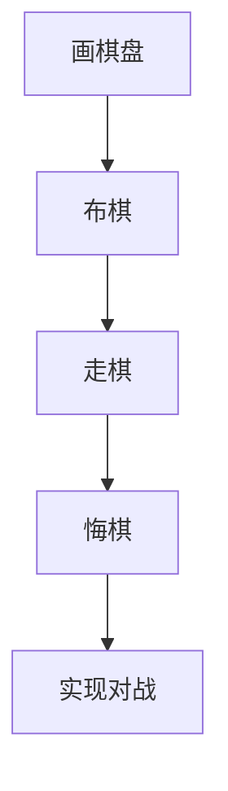
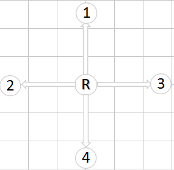
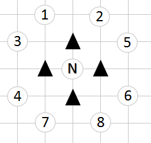
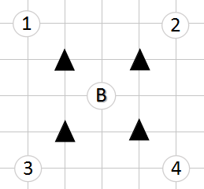
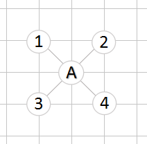
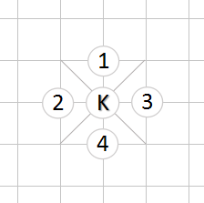
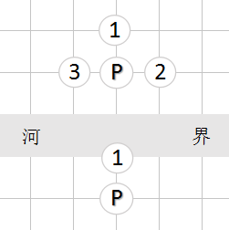

# H5实战：中国象棋对战游戏


### 技能需求：

html、css、js(ES6)

canvas

gulp、babel

nodejs、websocket(nodejs-websocket)

## 编程思路


#### 画棋盘

. 用小方块循环画出上下半区，中间一个长矩形块，写字“楚河 汉界”，布棋点效果
. 自适应的棋盘：可以自由设置棋盘每个格子的尺寸以及棋盘的边距，字随棋盘自动调整

###### canvas 知识点

```JS

//绘制基本图形
context.strokeRect(100,100,200,50)
context.lineTo(100,200)
context.lineCap = 'round'
context.lineJoin = 'round'
context.clearRect(0,0,canvas.width,canvas.height)
context.drawImage(img,x,y,imgW,imgH)


//图形转换
context.save()
context.translate(x,y)
context.rotate(Math.PI)
context.restore()

//文字
context.font = `bolder 20px 'Microsoft Yahei'`
context.textBaseline = "middle"
var fontW = context.measureText("汉界").width;
context.fillText("楚河", x,y);

//globalCompositeOperation 属性设置或返回如何将一个源（新的）图像绘制到目标（已有）的图像上
context.globalCompositeOperation = "source-over"

```

#### 布棋

用单位坐标系来布局棋子可以简化走棋的逻辑计算。
单位坐标系：以左上角为(0,0) 每一格为一个单位
如：左上第一个炮的坐标为{x:1,y:2}
Canvas坐标系与单位坐标系可以简单的进行转换


drawImage(img,pos.x,pos.y) 注意异步处理

#### 面向对象的改造

** 环境搭建**

gulp + babel

**board 棋盘对象**

属性

bw 棋盘格子尺寸

bm 棋盘边距（格子到边框距离）

arr[] 棋盘数据（二维数组存储每个着棋点的数据 arr[0] = [point,pos,piece]）

current 当前选中的棋子

step 步数

steps[] 存储每一步走棋

方法

init()

putPieces() 

initEvent()

websocketEvent()

undo()


**piece 棋子对象**

属性

text 文字

group 红方或黑方

pos {x:0,y:0}

方法

canPut()

put()

canEat()

eat()

各种棋子的走法


#### 棋子走法及规则

initEvent() 根据鼠标点击获得 mousePos（着棋点） 根据当前current值确定是选中、切换、走棋、吃子

websocketEvent() 从ws服务器获取数据实现同步走棋

canPut(targetPos) 是否可以走到这个位置去

put(targetPos)  走棋

canEat(targetPiece) 是否可以吃目标棋子

eat(targetPiece) 吃子


每种类型的棋子对应自己的走法，除炮外，所有棋子都是在自己的走棋路径上吃子

c()  车走直线 不能阻挡



m()  马走日字 蹩马腿



x()  相走田字 不能过河 堵田心



s()  仕走斜线 不能出宫



j()  走相邻位置（直线） 不能出宫



p()  走线与车一样，但吃法是直线隔子吃子，与目标棋子中间有且只能有一子


z()  卒走直线 只能前进 过河后可以横走




#### 悔棋

steps[step] = {currentPieces, currentPos , targetPiece ,targetPos }

undo() 

 两个位置都还原棋子， 原来走动的棋子 还要将pos恢复成原来的位置  

 steps[step] = null

 step--

 current = false


#### 基于Websocket的对战改造


HTML5规范中，WebSocket API 客户端-服务器的异步通信方法服务器和客户端可以在给定的时间范围内的任意时刻，相互推送信息。

搭建本地ws服务器 参考https://github.com/sitegui/nodejs-websocket

**简单改造：**

走棋传递及接收数据： {currentPos,targetPos}  根据数据改变current 触发websocketEvent(targetPos)

websocketEvent() 根据initEvent()简单改造

悔棋发送数据"undo" 触发 undo()


## 知识点


#### webSocket API

```JS

var ws = new WebSocket("ws://localhost:8081");
ws.onopen = function() {
    console.log("连接成功");
}
ws.onmessage = function(e) {
    console.log(e.data)
}
ws.onclose = function() {
    console.log("连接关闭")
}

btn.onclick = function() {
    ws.send("发送的内容");
}
```

####  ES6

```JS

//字符串
`字符串拼接 ${a} 字符串拼接`
//ES6类的写法
class Board {
    constructor(props){
        this.bw = props.bw
    }
    method(){
		console.log("do something...")
    }
}

//箭头函数
(参数1,参数2...) => {
    //函数体
}

//模块化
import A from './A.js'
export default

```
#### json对象与字符串的转换
```JS
var str = JSON.stringify(jsonObj)
var jsonObj = JSON.parse(jsonStr)
```

#### gulp babel 实现ES6 to ES5

```JS

var gulp = require("gulp");
var babel = require("gulp-babel");
gulp.task("default", function () {
  return gulp.src("src/*.js")
    .pipe(babel())
    .pipe(gulp.dest("js"));
});

gulp.watch("src/*.js",["default"]);

```


#### 后续改造的思考

>1. 对战时 如何确定博弈双方，让自己只能走己方的棋子？

>2. 对战时 调整程序让各自操作的棋子都显示在下方？

>3. 悔棋前 先取得对方的许可？

